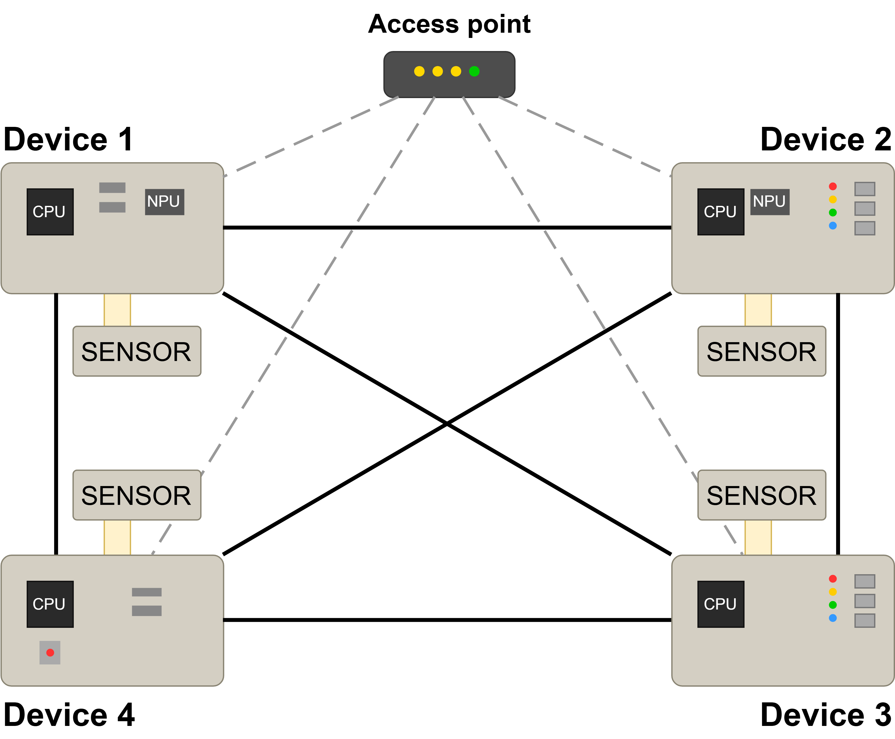
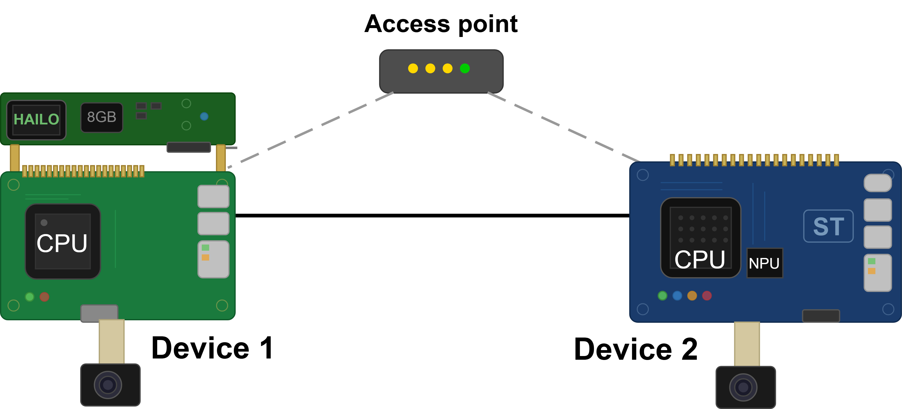

# P2P Device Network

A zero-configuration peer-to-peer communication layer for embedded Linux devices. Nodes discover each other automatically, maintain a live peer registry, and exchange messages over direct TCP connections - no broker, no central server.
NOTE: THE PARAGRAPHS REGARDING MESH NETWORKING ARE ONLY THEORETICAL AND HAVE YET TO BE IMPLEMENTED. AS OF RN THE CONNECTION IS ESTABLISHED EITHER VIA LAN (requires editing BROADCAST_ADDR IN discovery.py TO SPECIFY THE SUBNET) EITHER VIA WIFI (BROADCAST_ADDR = 255.255.255.255, IP assigned thanks to dhcp).

---

## Architecture

### Generic schema

Any IP-capable device running the stack can participate. Devices discover each other via a shared broadcast domain and establish direct P2P connections. An optional DHCP/infrastructure layer handles IP assignment - if using a mesh network, this is replaced by static or MAC-derived addressing.



### Tested setup

The setup tested in development includes a Raspberry Pi 5 (with Hailo), an STM32MP257FDK, an Intel NUC, and one or more generic Linux devices. All nodes run the same code. Any device can broadcast to all others or send targeted messages.



---

## How it works

The system is split into two cooperating modules. `Discovery` handles the "who's out there?" problem using UDP broadcasts. `P2PTransport` handles the actual message exchange over TCP connections. Together they give every node a live, self-updating map of the network with no manual configuration.

| Layer | Role |
|---|---|
| `run_leader`/`sensing_agent` | Calls `transport.send()` or `transport.broadcast()` by agent ID - never touches IPs directly |
| `P2PTransport` | TCP server + client. Maintains peer registry. Dispatches to `on_message` callback on receipt |
| `Discovery` | UDP broadcast announcer + listener. Fires `on_peer_found` / `on_peer_lost` as the network changes |
| Network layer | Any IP network: direct Ethernet, router WiFi, or mesh (e.g. batman-adv). The code is layer-agnostic |

The two modules wire together through callbacks. `Discovery`'s `on_peer_found` is wired directly to `transport.register_peer()`, and `on_peer_lost` to `transport.unregister_peer()`. Once started, everything is automatic.

---

### Discovery module

`Discovery` runs three daemon threads. The announcer broadcasts a `HELLO` UDP packet every 5 seconds containing the node's agent ID and TCP port. The listener receives these packets on all interfaces and registers new peers. The watchdog evicts any peer not seen for 15 seconds.

| Thread | Protocol | Role |
|---|---|---|
| `_announce_loop` | UDP broadcast | Sends `HELLO` every 5s on all interfaces |
| `_listen_loop` | UDP, port 9999 | Receives `HELLO` from peers, calls `_register()` |
| `_watchdog_loop` | - | Evicts peers not seen within 15s timeout |

> **Multi-interface note.** The announcer sends to the limited broadcast address `255.255.255.255`, which the OS routes out a single interface - typically the one owning the default route. On a device with both Ethernet and WiFi active on different subnets, this means peers on the non-default interface won't receive the announcement. The listener binds to `0.0.0.0` and receives on all interfaces, so the receive side works regardless. If you need simultaneous discovery across multiple interfaces, the announcer should be modified to enumerate the device's interfaces and send one broadcast per subnet (e.g. `10.0.0.255` and `192.168.1.255`).

All access to the shared `_peers` dict is protected by a `threading.Lock()`. The lock is released before calling `on_peer_found` or `on_peer_lost` to avoid deadlocks - callers must not re-acquire the lock inside those callbacks.

---

### Transport module

`P2PTransport` runs a TCP server that accepts connections from any peer. Each incoming connection is handled in a new daemon thread. Messages are newline-delimited JSON. The `from` field is injected automatically by the sender.

| Method | Description |
|---|---|
| `send(peer_id, msg)` | Opens a TCP connection to the named peer, sends a JSON message, closes the socket |
| `broadcast(msg)` | Snapshots the peer registry, calls `send()` for each peer. Unreachable peers are logged, not raised |
| `register_peer()` | Wired to Discovery's `on_peer_found` - adds a peer to the routing table |
| `unregister_peer()` | Wired to Discovery's `on_peer_lost` - removes a peer from the routing table |

> **Asyncio** The current implementation uses asyncio to manage the TCP connections.

---

### Wiring it together
this is roughly what is done in `main.py` to wire those modules togheter:

```python
def _on_p2p_message(msg: dict):
    print(f"[{msg['from']}] {msg}")

transport = P2PTransport(
    agent_id="pi-1",
    port=8000,
    on_message=_on_p2p_message
)

discovery = Discovery(
    agent_id="pi-1",
    tcp_port=8000,
    on_peer_found=transport.register_peer,   # wired directly
    on_peer_lost=transport.unregister_peer   # wired directly
)

transport.start()
discovery.start()

# Send a targeted message
transport.send("pi-2", {"type": "hello"})

# Broadcast to all known peers, through TCP (not UDP broadcast which is used only for discovery)
transport.broadcast({"type": "status", "value": 42})
```

---

## Protocol summary

All messages are JSON. Discovery runs over UDP (port `9999`); everything else is newline-delimited JSON over each peer's TCP port. Every TCP message carries an auto-stamped `from` (the sender's agent-ID).

| Plane | Message | Shape |
|---|---|---|
| Discovery (UDP) | `HELLO` | `{"type":"HELLO", "id":<agent_id>, "port":<tcp_port>}` |
| Election (TCP) | `HELLO` | `{"type":"HELLO", "from":<id>, "score":<int>, "has_leader_preset":<bool>, "sensing_preset":<str\|null>, "leader_preset":<str\|null>}` |
| Election (TCP) | `ELECTION` | `{"type":"ELECTION", "from":<id>, "score":<int>}` |
| Election (TCP) | `LEADER_CLAIM` | `{"type":"LEADER_CLAIM", "from":<id>, "score":<int>}` |
| Backup (TCP) | `CONV_BACKUP` | `{"type":"CONV_BACKUP", "from":<id>, "chat_id":<str>, "messages":[...], "leader_id":<id>, "ts":<float>}` |
| Backup (TCP) | `CONV_RESTORE_REQ` | `{"type":"CONV_RESTORE_REQ", "from":<id>, "chat_id":<str\|"*">}` |
| Backup (TCP) | `CONV_RESTORE_RESP` | `{"type":"CONV_RESTORE_RESP", "from":<id>, "chat_id":<str>, "messages":[...], "ts":<float>}` |
| Operational (TCP) | `tools/list` / `tools/call` (JSON-RPC) | `{"jsonrpc":"2.0","id":<id>,"method":<m>,"params":{...}}` then `{"jsonrpc":"2.0","id":<id>,"result":{...}}` - see the command table above |
| Operational (TCP) | async alert (JSON-RPC notification) | `{"jsonrpc":"2.0","method":"notifications/sensing/alert","params":{...}}` (no `id`) |
| Console (TCP) | console broadcast | `{"text":<prompt input>}` |

> On election the leader also broadcasts a `CAPABILITY_ANNOUNCE` (model, hardware, peer count) used to build the greeting message. Messages with `type` route to election / backup / capability handlers; messages with `method` are JSON-RPC operational requests/notifications; the leftover `{"text": ...}` is the console broadcast.

## Mesh networking

The stack is network-agnostic and works over any IP-capable transport. Mesh networks (such as batman-adv) are one option, particularly useful in environments without a central router or access point.

With batman-adv, each device's physical WiFi interface (`wlan0`) is put into ad-hoc mode and managed by the batman-adv kernel module, which presents a virtual `bat0` interface to the OS. From Python's perspective, `bat0` is just a regular network interface - no code changes required.
The easiest setup with mesh networking is preconfiguring static IPs, this implies the need to assign different IPs when there is the need to scale and / or add modules.
---

## IP address assignment

Each device needs a unique IP before it can participate. The right approach depends on the deployment.

| Method | Best for | Notes |
|---|---|---|
| DHCP (router) | Standard networks | Works out of the box. Cannot be used with mesh - a new node can't get an IP before joining the mesh (bootstrap problem) |
| MAC-hash + /16 subnet | Small-medium fleets | Derives IP from MAC address. Conflict probability ≈0.07% for 10 devices. Requires no coordination |
| Hardcoded per device | Small stable fleets | Simplest and safest. Zero conflict risk. Edit a config file once per device |
| Coordinator + leader election | Large dynamic fleets | One node acts as DHCP server. On failure a new coordinator is elected (e.g. highest MAC wins). Complex to implement correctly |

DHCP is recommended and requires no additional setup when using a router.

> **IP collision warning.** 
If using static IPs:
Two devices sharing an IP break the network at the ARP layer - *even if they listen on different ports*. The router/switch can only map an IP to one MAC address at a time, and the two devices will continuously fight over the ARP entry by sending conflicting announcements. Whichever device "wins" the ARP race at any moment receives all traffic for that IP; the other becomes invisible. Connections flap, packets get dropped, and applications see intermittent failures with no clear cause. Different listening ports do not solve the problem because it happens before TCP is even involved. Always ensure unique IPs before connecting devices (if using a static-IP approach with no DHCP).


---

## Notes

- Discovery uses UDP port `9999` by default and all the nodes must be on the same discovery port to find themselves. 
- Changing the discovery port allows to have multiple subnetworks on the same network that do not see eachother.
- The transport port is configurable per node.
- The `agent_id` is application-defined. Choosen by the user, it MUST be unique.

---

## Problem solving

If two devices can't see each other, the issue is almost always at the network or firewall layer rather than in the code. Work through these checks before debugging the application.

### General checks (all platforms)

Before diving into platform-specific issues, confirm the basics:

1. **Same subnet?** Run `ip -4 addr show` on Linux or `ipconfig` on Windows on each device. All agents should share the same first three octets (e.g. all `192.168.1.x`). Different subnets means UDP broadcasts won't cross.
2. **Sockets actually listening?**
  - Linux: `ss -tlnp | grep <tcp_port>` and `ss -ulnp | grep 9999`
  - Windows: `Get-NetTCPConnection -LocalPort <tcp_port> -State Listen` and `Get-NetUDPEndpoint -LocalPort 9999`
3. **Direct connectivity?** From the other device, `ping <ip>` should succeed and `nc -v <ip> <tcp_port>` should connect.
  - `ping` fails → routing / subnet / client isolation issue, not firewall
  - `nc` says "Connection refused" → process isn't listening
  - `nc` hangs / "Connection timed out" → firewall is silently dropping packets
  - `nc` connects → firewall is fine, the issue is in the application

### Linux

Most Linux distros ship without an active inbound firewall by default, and the stack works out of the box. If `ufw`, `firewalld`, or `iptables` is enabled, allow inbound UDP 9999 and TCP `<tcp_port>`:

```bash
# ufw (Ubuntu, Debian)
sudo ufw allow 9999/udp
sudo ufw allow <tcp_port>/tcp

# firewalld (Fedora, RHEL)
sudo firewall-cmd --add-port=9999/udp --permanent
sudo firewall-cmd --add-port=<tcp_port>/tcp --permanent
sudo firewall-cmd --reload
```

Other things to check:

- **Multiple interfaces.** If the device has both Ethernet and WiFi active on different subnets, broadcasts go out only one of them. Either disable the unused interface or rely on the multi-interface announcer mentioned in the Discovery section.
- **VPN clients** (WireGuard, OpenVPN, Tailscale) can hijack default routes or add virtual interfaces that absorb broadcast traffic. Disable the VPN as a quick test.
- **Docker / libvirt bridges.** Bridges like `docker0` or `virbr0` can change which interface UDP broadcasts go out of. Check `ip route` and confirm the route to the LAN goes via your real interface.

### Windows

⚠️ **Windows is the platform where things go wrong most often.** Windows Firewall blocks inbound connections by default. This is the single most common reason the agent appears to start fine but never receives messages.

#### Step 1 - Check for existing block rules w.r.t. the Python interpreter

Open **PowerShell as Administrator** and run:

```powershell
Get-NetFirewallRule -Direction Inbound -Action Block -Enabled True |
  Where-Object { ($_ | Get-NetFirewallApplicationFilter).Program -like "*python*" } |
  Format-List DisplayName, Profile, @{N="Program";E={($_ | Get-NetFirewallApplicationFilter).Program}}
```

If any rule shows the path of the Python interpreter you'll use to run the agent, **disable it** before continuing:

```powershell
Get-NetFirewallRule -Direction Inbound -Action Block -Enabled True |
  Where-Object { ($_ | Get-NetFirewallApplicationFilter).Program -ieq "<full path to your python.exe>" } |
  Disable-NetFirewallRule
```

Replace `<full path to your python.exe>` with the actual path. To find it, run `(Get-Command python).Source` inside the conda env / venv you'll use to run the agent.

> Block rules win over Allow rules in Windows Firewall. If a Block rule exists for your Python executable, no amount of Allow rules will help - you have to disable the Block first.

#### Step 2 - Add allow rules for the agent

Still in admin PowerShell, replace `<python_path>` and `<tcp_port>` with your values:

```powershell
New-NetFirewallRule -DisplayName "P2P Discovery UDP" `
  -Direction Inbound -Protocol UDP -LocalPort 9999 `
  -Profile Private -RemoteAddress LocalSubnet `
  -Program "<python_path>" -Action Allow

New-NetFirewallRule -DisplayName "P2P Transport TCP" `
  -Direction Inbound -Protocol TCP -LocalPort <tcp_port> `
  -Profile Private -RemoteAddress LocalSubnet `
  -Program "<python_path>" -Action Allow
```

These rules should be scoped to:
- Your specific Python interpreter (no other process can use these ports)
- LAN devices only (no internet exposure)
- Private network profile only (no exposure on coffee shop / public WiFi)

ADVICE: double check what you do with the security of your connections because it is easy to mess up!

#### Step 3 - Make sure your network is marked Private

Run:

```powershell
Get-NetConnectionProfile
```

The WiFi network you use for the agent should show `NetworkCategory : Private`. If it shows `Public`, change it:

```powershell
Set-NetConnectionProfile -Name "<your network name>" -NetworkCategory Private
```

If you also see a profile called `"Unidentified network"` / `"Rete non identificata"` on the same interface, that's a Windows quirk and usually harmless as long as your real network is Private. If you want to also cover that case, duplicate the rules with `-Profile Public` (the `LocalSubnet` + `Program` scoping keeps them safe).

#### Step 4 - Verify

With the agent running on Windows, from another machine on the LAN:

```bash
nc -v <windows_ip> <tcp_port>
```

If it connects, you're set. If it hangs, go back to Step 1 - there's still a Block rule winning.

#### To remove the rules later

```powershell
Remove-NetFirewallRule -DisplayName "P2P Discovery UDP"
Remove-NetFirewallRule -DisplayName "P2P Transport TCP"
```

#### Other Windows-specific gotchas

- **Multiple network adapters.** Hyper-V, WSL, VMware, VPN clients, and Docker Desktop all add virtual adapters that can confuse UDP broadcast routing. If discovery only works one way, check `ipconfig` and confirm the IP being used is your real WiFi/Ethernet adapter, not a virtual one. Disable virtual adapters you don't need from Network Connections settings.
- **Conda envs / multiple Python installs.** Firewall rules are bound to a specific `python.exe` path. If you switch envs, the rules won't apply to the new interpreter. Either add new rules for the new path or use the same env consistently.
- **Block rules persist across reinstalls.** Deleting a Python install doesn't delete its firewall rules. If you reinstall Python at the same path later, any old block rules will still apply. Always re-check Step 1 after any Python reinstall.
- **PowerShell must be Administrator.** All `New-NetFirewallRule` / `Set-NetFirewallRule` / `Disable-NetFirewallRule` commands require an elevated shell. If they fail silently or you don't see your changes reflected in `Get-NetFirewallRule`, the shell isn't admin.

### Known gotchas (any platform)

- **Different subnets.** If two agents have IPs like `192.168.1.x` and `192.168.2.x`, they're on different subnets and UDP broadcasts won't cross between them. This happens on:
 - Mesh WiFi systems with separate IoT/guest SSIDs
 - Networks with "AP isolation" / "client isolation" enabled
 - Mixing wired LAN and WiFi when the router treats them as different networks
 - VPNs intercepting traffic
- **Client isolation.** Some routers (especially hotspot wifis of e.g. samsung smartphones) block client-to-client traffic even on the same subnet. If `ping` between two devices fails but both have internet, suspect this. Disable isolation in the router admin panel (if possible) or change network.
