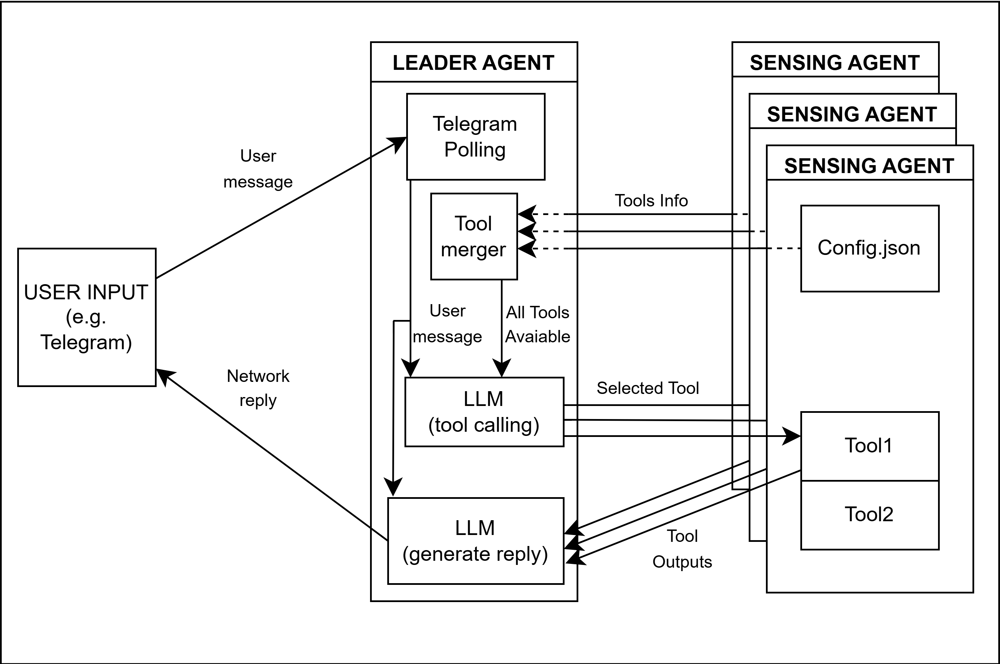
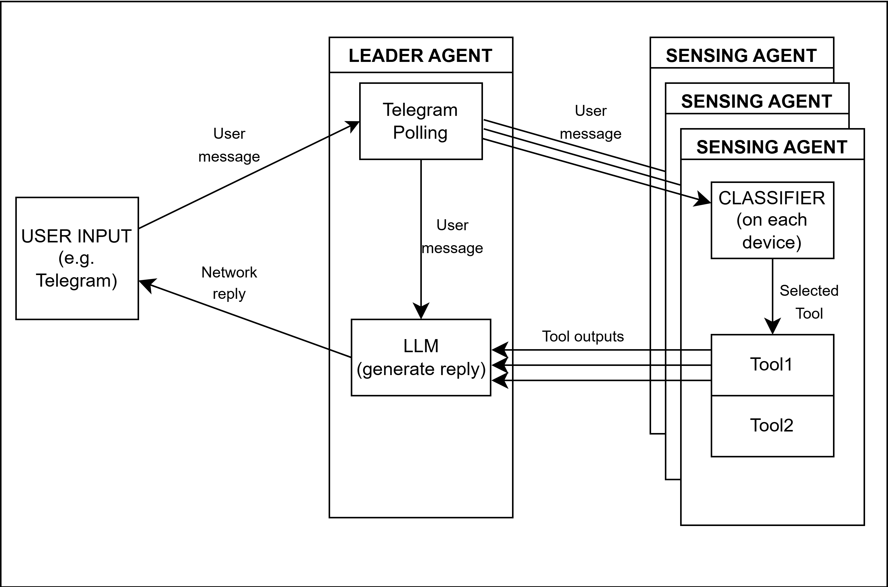

# Implementation

> Back to [root README](../README.md)

---

## Table of Contents

- [Introduction](#introduction)
- [Communication](#communication)
- [Setup](#setup)
- [Benchmarks](#benchmarks)

---

## Introduction

A distributed agentic system where a fleet of embedded devices collaborate over a P2P network. A **Leader** device manages user interaction via Telegram and dispatches commands to **Sensing Devices**, which execute hardware-accelerated skills (object detection, face recognition, camera capture) and return results. The Leader runs an LLM to translate natural language into commands and to format replies.

### Two-Step LLM Pipeline

Every user request goes through a two-step inference pipeline:

1. **Dispatch** - the LLM converts the user's natural-language message into a canonical command, using the available skill list fetched dynamically from the network.
2. **Broadcast** - the command is sent over TCP to all known peers; replies are collected (configurable timeout, default 3 s).
3. **Answer** - a second LLM call formats the collected results into a human-friendly Telegram reply.

### Architecture

We propose 2 architectures, currently only the first one (fully LLM based dispatch and answer generation) is implemented.





> The leader can simultaneously act as a sensing device.

### Legend of Terms

**Message**
A text payload sent from one device to another (or to itself) in the network.

**Command**
A message sent to a device to run one of its tools. The operational plane is **JSON-RPC 2.0**: the leader (the MCP *client*) sends a request carrying a correlation `id`, and the sensing device (the MCP *server*) answers with a same-`id` result or error. The transport auto-stamps a `from` field with the sender's agent-ID.

| Message | Direction | Shape |
|---|---|---|
| `tools/list` request | Leader → Sensing | `{"jsonrpc":"2.0","id":<id>,"method":"tools/list"}` |
| `tools/list` result | Sensing → Leader | `{"jsonrpc":"2.0","id":<id>,"result":{"tools":[<tool defs>]}}` |
| `tools/call` request | Leader → Sensing | `{"jsonrpc":"2.0","id":<id>,"method":"tools/call","params":{"name":<tool>,"arguments":{...}}}` |
| `tools/call` result | Sensing → Leader | `{"jsonrpc":"2.0","id":<id>,"result":{"content":[{"type":"text","text":<result>}]}}` |
| `tools/call` error | Sensing → Leader | `{"jsonrpc":"2.0","id":<id>,"error":{"code":<int>,"message":<str>}}` |
| `notifications/sensing/alert` | Sensing → Leader | `{"jsonrpc":"2.0","method":"notifications/sensing/alert","params":{"tool":<str>,"text":<str>}}` (no `id`) |

These are the **Operational** plane of the [communication protocol](#communication). Notes:
- Replies are matched to their request by `id`, so concurrent, late, or stray messages never cross requests. The leader dispatches a picked tool to **all** sensing devices that own it and concatenates their replies.
- Skill discovery is pull-on-join: the leader calls `tools/list` once when it discovers a device and keeps a live tool to owners registry, so there is no per-request fetch. (The old `fetchskills` text command and the `raw_command` classifier path are gone.)
- A device that does not answer a `tools/call` within the leader's timeout (default 3s) is recorded as "did not reply".
- `notifications/sensing/alert` is a JSON-RPC notification (no `id`, no reply) used by a long-running skill to push a later hit; leader-side delivery of the alert to the user is not wired yet.

**Tool**
A function that a sensing device can execute. Each device advertises its tools to the leader via `tools/list` (pulled by the leader when the device joins). Tools are OpenAI-compatible function definitions, so the LLM can decide which tool in the network best serves the user's request.

**Skill**
A broader term referring to what a sensing device can do - essentially an alias for the available tools on that device.

**Sensing Device**
Any device in the network that ships with a preset folder under `SensingLogic/`. Each preset contains a `tool_config.json` with:
- `tool_defs` - OpenAI-compatible tool definitions exposed to the LLM.
- `skills` - maps the tool name (as the LLM sees it) to the actual function and file to execute. This decoupling improves LLM dispatch accuracy.

**Leader**
One device in the network elected as leader. The leader manages user communication (Telegram) and dispatches commands to sensing devices. The leader can simultaneously act as a sensing device.

**Agent ID**
The unique identifier used to distinguish agents in the network. If a device acts as both leader and sensing device, it holds two different agent IDs and behaves as two distinct agents on the same IP.

---

### Leader Presets

A leader preset is a folder under `LeaderLogic/<preset>/` holding a `leader.py` - the leader-side mirror of a `SensingLogic/<preset>/` folder holding a `tool_config.json`. The shared entry point, `LeaderLogic/run_leader.py`, owns the network wiring and the two-step pipeline (query → tool → devices, tool result → reply); each preset only supplies the two model-specific pieces of it (`dispatch`, `answer`). See [`LeaderLogic/leader.md`](LeaderLogic/leader.md) for the exact contract.

Each device is assigned a leader preset in its `device_profile.json` (the menu at first-run setup is built from whatever preset folders exist, so a new one becomes selectable with no code change - see `ElectionLogic.identity.discover_leader_presets()`).

| Preset folder | Dispatch | Answer | Hardware |
|---|---|---|---|
| `raspberry_cpu` | `qwen3:1.7b` (CPU Ollama) | same (CPU Ollama) | Raspberry Pi 5 |
| `raspberry_hailo` | `qwen3:1.7b` (Hailo native `.hef`) | same (Hailo NPU) | Raspberry Pi 5 + Hailo AI HAT 2 |
| `raspberry_cpuhailo` | `functiongemma:270m` (CPU Ollama) | `qwen3:1.7b` (Hailo NPU) | Raspberry Pi 5 + Hailo AI HAT 2 |
| `generic` | Score-selected (see below) | same | Any device |
| `stm32mp257fdk` | `functiongemma:270m` (llama.cpp) | same | STM32MP257FDK |
| `mock` | - | - | Any device (no LLM; election/backup/failover testing) |

`raspberry_cpuhailo` is the recommended Pi+Hailo preset: FunctionGemma is purpose-built for tool-calling and runs cheaply on CPU, while the Hailo NPU handles the more expensive answer-generation step. Unlike the old `/changehost`-cycled workflow modes, each Pi+Hailo preset is now a separate, static leader selection made once at first-run setup.

#### Generic leader - score-based model selection

The `generic` preset picks its GGUF model from the device score computed at startup. The score reflects available RAM, CPU, and hardware capabilities.

| Score | Model | Backend |
|---|---|---|
| ≥ 170 | `qwen3:1.7b` | llama.cpp, CPU |
| < 170 | `functiongemma:270m` | llama.cpp, CPU + FG handler |

Score-based selection is controlled by the `LLM_detection_with_score` flag in `LeaderLogic/generic/leader.py` (default `False` → always `functiongemma:270m`).

#### Fallback chain example

- Primary leader: Raspberry Pi 5 + Hailo, e.g. running the `raspberry_cpuhailo` preset.
- If the Pi fails, leader election promotes the next highest-scoring device.
- The STM32MP257FDK can act as leader using `functiongemma:270m` via llama.cpp (lower performance).

---

### Configuration

The system uses two separate config files per device:

**`software_config.json`** - static, shared across leader and sensing roles (the agent-ID is **not** here - it lives in `device_profile.json`):
```json
{
  "agent":    { "tcp_port": 5555 },
  "telegram": { "token": "...", "allowed_users": [...] },
  "timeouts": { "fetchskills": 1.5, "replies": 3.0, "loop": 0.0 }
}
```

The `telegram` section is filled in by first-run setup, but **only on a device that
declares a leader preset other than `none`** - the elected leader is the only role that
runs the bot, so a follower-only device is never asked and keeps the placeholders. You
are prompted for the bot token (from @BotFather) and the comma-separated numeric user
IDs allowed to talk to it (from @userinfobot); both are required and the prompt repeats
until they are valid. See `ElectionLogic.identity._prompt_telegram()`.

> **This file is tracked by git.** Once first-run setup has written a real token and
> real user IDs into it, restore the placeholders before committing or pushing - a
> token that reaches the remote is compromised and must be rotated.

#### First-run setup screen

The setup prompts are drawn with the ANSI colour constants in `utils.py` (`BOLD`,
`DIM`, `CYAN`, `GREEN`, `YELLOW`, `RED`). Two deliberate constraints keep one
identical layout on every target, from a dev laptop to the STM32MP257F-DK panel:

- **ASCII only.** No box-drawing characters, arrows or dashes. A bare-bones
  console cannot encode them and raises `UnicodeEncodeError` mid-setup.
- **Max 74 columns**, so nothing wraps on a small 720p screen.

Colour is the only thing that varies: the constants collapse to `""` when stdout
is not a TTY, so redirected output and log files stay free of escape codes. The
layout itself never changes. Log lines are unaffected: they are parsed, so they
never go through these constants.

**`LeaderLogic/<preset>/config.json`** - Pi+Hailo presets only, device-specific inference config (each preset reads only the section(s) it needs):
```json
{
  "llm_cpu":              { "host": "http://127.0.0.1:11434", "model": "qwen3:1.7b" },
  "llm_cpu_tool_calling": { "host": "http://127.0.0.1:11434", "model": "functiongemma" },
  "hailo":                { "hef_path": "models/qwen3-1.7b.hef" }
}
```

**`SensingLogic/<preset>/tool_config.json`** - sensing device only, defines the tools it exposes to the network:
```json
{
  "skills":   [{ "file": "...", "function": "...", "command": "..." }],
  "tool_defs": [{ "type": "function", "function": { "name": "...", ... } }]
}
```

---

### Where to put the models

Model files are kept in two different places depending on which agent uses them:

- **Leader LLM models** go in the top-level **`IMPLEMENTATION/models/`** folder. The `generic` / `stm32mp257fdk` presets look there for their GGUF (e.g. `Qwen3-1.7B-Q4_K_M.gguf`, `functiongemma-270m-it-Q4_K_M.gguf`) and download it from Hugging Face into that folder if it is missing. For the `raspberry_hailo` / `raspberry_cpuhailo` presets, the native `.hef` is found via the `hailo.hef_path` entry in `LeaderLogic/<preset>/config.json` (e.g. `models/qwen3-1.7b.hef`).
- **Sensing models** go **inside the sensing agent's own preset folder**, next to its code - each preset resolves its model relative to itself (`Path(__file__).parent / "<model>"`). For example `SensingLogic/raspberrypi5_yolo_NPU/yolov8n.hef`, `raspberrypi5_yolo_CPU/yolov8n.onnx`, and `stm32mp257_yolo_NPU/yolov8n_320_quant_pt_uf_od_coco-person-st.nb`. Drop a new sensing model in the same folder as the skill that loads it.

---

### Available Skills

Skills are defined per sensing device in `tool_config.json` and discovered dynamically by the leader via `fetchskills` - no leader configuration change is needed when new skills are added.

Example skills on the STM32MP257FDK legacy sensing agent:

| Command | Description |
|---|---|
| `recognize` | Identify a face using the camera |
| `add_face <name>` | Enroll a new face |
| `remove_face <name>` | Delete a stored face |
| `list_faces` | List all enrolled faces |
| `detect_objects_now` | Single-shot object detection |
| `run_till_detect <object>` | Continuously detect until target is found |

The `meeting_room_raspberry` and `meeting_room_stm` presets are a worked example of the same mechanism: each exposes a single `detect_people_number` skill that counts the people in a meeting room, so asking the leader whether the room is free fans the tool out to whichever devices are watching it.

Available to the leader:

| Command | Description |
|---|---|
| `/start` | Welcome card: what the network does, the tools currently reachable (with the devices owning each), this leader's capabilities, and the command keyboard |
| `/capabilities` | The tools reachable right now, each with the devices that own it |
| `/status` | Show the currently active inference mode |
| `/changehost` | Cycle to the next inference mode (Pi+Hailo leader only) |
| `/loop` | Keep re-running the tool each question picks, and message again when the result changes |
| `/loop off` | Stop looping |

`/capabilities`, `/status`, `/loop` and `/loop off` are also offered as a persistent keyboard
under the text input, and registered in Telegram's native `/` menu via
`setMyCommands` when polling starts. A button just sends its own label as a
normal message, so it reaches the same branch a typed command does.

### Message formatting

`TelegramBot` has two send paths, and the split matters:

- `send_message()` - **no** `parse_mode`. Everything the model writes goes out
  through this one, byte for byte.
- `send_card()` - `parse_mode=HTML`, for system-authored text only (the `/start`
  welcome, `/status`, leader announcements, the failover notice, loop notices).
  These strings are written in `LeaderLogic/capabilities.py`, so their markup is
  known-safe; dynamic values spliced into them (agent ids, model and tool names)
  go through `capabilities._esc()`.

The reason for the split: a `parse_mode` applies to the whole message, and one
stray `<` or `*` in free text makes Telegram reject it outright, so the user
would get nothing at all. Model output is never escaped or restyled.

Cards use one bold-labelled fact per line, never space-padded columns or ASCII
boxes: Telegram renders in a proportional font whose width varies by device, so
padded columns only line up on the screen they were tuned for.

### `/loop`

Normally a question is one shot: pick a tool, dispatch it, answer, done. With
`/loop` on, the leader keeps re-dispatching the tool that the question picked
and speaks again **only when the result changes** - so "how many people are
there?" answers "there are 2", stays quiet while it stays 2, and sends an
`UPDATE` when it becomes 3.

- Entirely leader-side: sensing agents keep serving ordinary one-shot
  `tools/call` requests and are unaware they are being polled.
- Results are compared per device (`{agent_id: text}`), so with the same tool on
  several devices (say a camera in two rooms) any one of them changing produces
  one recomputed answer covering the whole fleet.
- Each new question stops the previous loop (`loop for <tool> stopped`) and
  starts one for the tool it picks. The setting stays on until `/loop off`.
- `timeouts.loop` is the delay added between iterations, in seconds. `0.0` means
  none: dispatch (capped by `timeouts.replies`) and the answer generation set
  the real pace.
- A loop is live state, not conversation: it is not replicated to backup peers
  and does not survive a leader failover.

---

## Communication

The P2P networking layer handles peer discovery and message transport with zero manual configuration. Nodes discover each other automatically via UDP broadcast and exchange messages over direct TCP connections - no broker, no central server.

→ See [`ConnectionLogic/README.md`](ConnectionLogic/README.md) for full details.

### Protocol summary

All messages are JSON. Discovery runs over UDP (port `9999`); everything else is newline-delimited JSON over each peer's TCP port. Every TCP message carries an auto-stamped `from` (the sender's agent-ID).

| Plane | Message | Shape |
|---|---|---|
| Discovery (UDP) | `HELLO` | `{"type":"HELLO", "id":<agent_id>, "port":<tcp_port>}` |
| Election (TCP) | `HELLO` | `{"type":"HELLO", "from":<id>, "score":<int>, "has_leader_preset":<bool>, "sensing_preset":<str\|null>, "leader_preset":<str\|null>}` |
| Election (TCP) | `ELECTION` | `{"type":"ELECTION", "from":<id>, "score":<int>}` |
| Election (TCP) | `LEADER_CLAIM` | `{"type":"LEADER_CLAIM", "from":<id>, "score":<int>}` |
| Backup (TCP) | `CONV_BACKUP` | `{"type":"CONV_BACKUP", "from":<id>, "chat_id":<str>, "messages":[...], "leader_id":<id>, "ts":<float>}` |
| Backup (TCP) | `CONV_RESTORE_REQ` | `{"type":"CONV_RESTORE_REQ", "from":<id>, "chat_id":<str\|"*">}` |
| Backup (TCP) | `CONV_RESTORE_RESP` | `{"type":"CONV_RESTORE_RESP", "from":<id>, "chat_id":<str>, "messages":[...], "ts":<float>}` |
| Operational (TCP) | `tools/list` / `tools/call` (JSON-RPC) | `{"jsonrpc":"2.0","id":<id>,"method":<m>,"params":{...}}` then `{"jsonrpc":"2.0","id":<id>,"result":{...}}` - see the command table above |
| Operational (TCP) | async alert (JSON-RPC notification) | `{"jsonrpc":"2.0","method":"notifications/sensing/alert","params":{...}}` (no `id`) |
| Console (TCP) | console broadcast | `{"text":<prompt input>}` |

> On election the leader also broadcasts a `CAPABILITY_ANNOUNCE` (model, hardware, peer count) used to build the greeting message. Messages with `type` route to election / backup / capability handlers; messages with `method` are JSON-RPC operational requests/notifications; the leftover `{"text": ...}` is the console broadcast.

---

## Setup

> **Requirements depend on the role.** There is no single requirements file - what a device needs depends on what it runs:
> - **Everyone:** `requirements/base.txt` (`psutil`, `requests`).
> - **Leader:** an LLM backend - `LeaderLogic/<preset>/requirements.txt`, e.g. `LeaderLogic/generic/requirements.txt` (`llama-cpp-python`), `LeaderLogic/stm32mp257fdk/requirements.txt` (llama.cpp **cross-compiled**, see below), or `LeaderLogic/raspberry_cpu|raspberry_hailo|raspberry_cpuhailo/requirements.txt` (Ollama and/or the Hailo SDK, no llama-cpp-python).
> - **Sensing:** the model runtime for its preset - `SensingLogic/<preset>/requirements.txt`. A sensing-only device needs **no** LLM backend; a leader-only device needs **no** detection runtime.
>
> On first run, `main.py` auto-installs the pip-installable lines for the roles you pick. The hardware runtimes (`hailo_platform`, `stai_mpu`, `tflite_runtime`, `picamera2`, STM32 `llama-cpp-python`) are **not** pip packages - each preset's requirements file documents the real `apt` / `x-linux-ai` / Hailo SDK / cross-compile command in its comments.

### Minimal Test Setup

As shown in [`ConnectionLogic/README.md`](ConnectionLogic/README.md) (`image/network_minimal.png`):

- **Raspberry Pi 5** (optionally with Hailo AI HAT 2)
- **STM32MP257FDK**
- **camera module BCAMSIMX$MZ1** (camera module for STM32MP257FDK board)
- **picamera2**

---

### Raspberry Pi 5

1. Flash the official Raspberry Pi OS from the [Raspberry Pi website](https://www.raspberrypi.com/software/).

2. Connect the Hailo accelerator to the board through the PCIe port.

3. Install Hailo dependencies. The required version (5.3) is **not available via `apt`** - download the `.deb` packages manually from the [Hailo Developer Zone](https://hailo.ai/developer-zone/) and install with `dpkg`:

```bash
sudo dpkg -i hailort_<version>_arm64.deb
sudo dpkg -i hailort-pcie-driver_<version>_arm64.deb
```

4. Install Ollama and pull the CPU models:

```bash
curl -fsSL https://ollama.com/install.sh | sh
ollama pull qwen3:1.7b
```

5. Place the `qwen3:1.7b` `.hef` file at the path set in `LeaderLogic/raspberry_hailo/config.json` and `LeaderLogic/raspberry_cpuhailo/config.json` (`hailo.hef_path`).

6. You can also install llama-cpp-python and use the `generic` preset as the Leader preset instead.
```bash
pip install llama-cpp-python
```
Check that llama.cpp backend gets compiled with the correct arm support.

---

### STM32MP257FDK

1. Flash **OpenSTLinux** onto the board following ST's official flashing guide.

2. Install the AI expansion package:

   1. **Ensure Internet Connection** - connect the board to the network (via Ethernet or WiFi). Follow the instructions in *"3. Automatic WiFi configuration at start up"* on the [ST wiki](https://wiki.st.com/stm32mpu/wiki/How_to_setup_a_WLAN_connection#Automatic_WiFi_configuration_at_start_up).

   2. **Synchronize Repository** - sync the OpenSTLinux package repository:
```bash
apt-get update
```

   3. **Install Tool Package** - install the core AI management tool:
```bash
apt-get install x-linux-ai-tool
```

   4. **Verify Installation** - check the version (e.g. `6.2.0`):
```bash
x-linux-ai -v
```

   5. Clone the repo in `/home/weston`.

3. Install the STAI MPU Python runtime and image libraries (needed by the sensing skills). Following ST's [How to run inference using the STAI MPU Python API](https://wiki.st.com/stm32mpu/wiki/How_to_run_inference_using_the_STAI_MPU_Python_API):

```bash
apt-get install python3-numpy python3-opencv
x-linux-ai -i python3-libstai-mpu        # provides the `stai_mpu` module (NPU preset)
x-linux-ai -i stai-mpu-tflite            # TFLite plugin (CPU preset)
```

> These are the deps documented in each STM32 sensing preset's `requirements.txt` - they are installed via `apt` / `x-linux-ai`, **not** pip. If this device is also an STM32 **leader** (FunctionGemma), see *Cross-compiling `llama-cpp-python` for the STM32MP2* below.

4. Attach the camera to the board.

More info on the AI packages: [X-LINUX-AI expansion package](https://wiki.st.com/stm32mpu/wiki/Category:X-LINUX-AI_expansion_package#X-LINUX-AI_package)

---

### Cross-compiling `llama-cpp-python` for the STM32MP2 (Cortex-A35)

Only needed if the STM32MP257F-DK acts as a **leader** (runs FunctionGemma via llama.cpp). `llama-cpp-python` is left commented in `LeaderLogic/stm32mp257fdk/requirements.txt` because a plain `pip install` builds without NEON or runs out of memory on the board - instead **cross-compile the wheel on an x86_64 host** and install it on the board.

Target: OpenSTLinux `5.0.15-...-scarthgap-mpu-v26.02.18`, Cortex-A35 (AArch64).

#### 1. Get the SDK

Download (needs free myST login + accept SLA0048):
- Page: https://wiki.st.com/stm32mpu/wiki/STM32MPU_Developer_Package
- File: `SDK-x86_64-stm32mp2-openstlinux-6.6-yocto-scarthgap-mpu-v26.02.18.tar.gz`

Install guide: https://wiki.st.com/stm32mpu/wiki/Getting_started/STM32MP2_boards/STM32MP257x-DK/Develop_on_Arm_Cortex-A35/Install_the_SDK

#### 2. Install the SDK (host)

```bash
tar xf SDK-x86_64-stm32mp2-openstlinux-6.6-yocto-scarthgap-mpu-v26.02.18.tar.gz
cd SDK-x86_64-stm32mp2-*
./st-image-weston-*-toolchain-5.0.15-*.sh     # accept default install dir /opt/st/...
```

#### 3. Activate the toolchain (host)

```bash
source /opt/st/.../environment-setup-cortexa35-ostl-linux
```

Verify (both must succeed):

```bash
echo $OECORE_SDK_VERSION   # -> 5.0.15-openstlinux-6.6-yocto-scarthgap-mpu-v26.02.18
$CC --version              # -> ST cross-gcc
```

#### 4. Check Python versions match

```bash
# on the BOARD:
python3 --version
```

The host Python that runs `pip wheel` must be the SAME minor version (e.g. 3.12). Wheels are not interchangeable across minor versions.

#### 5. Build the wheel (host)

```bash
CMAKE_ARGS="-DGGML_NATIVE=OFF \
  -DGGML_NEON=ON \
  -DGGML_ARM_FMA=ON \
  -DGGML_F16C=OFF \
  -DGGML_AVX=OFF \
  -DGGML_AVX2=OFF \
  -DGGML_AVX512=OFF \
  -DGGML_FMA=OFF \
  -DGGML_SSE3=OFF \
  -DGGML_OPENMP=OFF \
  -DLLAMA_CURL=ON \
  -DLLAMA_BUILD_TESTS=OFF \
  -DLLAMA_BUILD_SERVER=OFF \
  -DCMAKE_C_FLAGS='-mcpu=cortex-a35+crc -O3 -ffast-math -fno-finite-math-only' \
  -DCMAKE_CXX_FLAGS='-mcpu=cortex-a35+crc -O3 -ffast-math -fno-finite-math-only'" \
FORCE_CMAKE=1 \
pip wheel llama-cpp-python --no-deps -w ./dist
```

Output: `./dist/llama_cpp_python-*.whl`

#### 6. Copy to board

```bash
scp ./dist/llama_cpp_python-*.whl root@<board-ip>:/tmp/
```

#### 7. Install (board)

```bash
# you may need to install pip first
pip install /tmp/llama_cpp_python-*.whl
```

#### 8. Run (board)

```python
from llama_cpp import Llama
llm = Llama(model_path="model.gguf", n_threads=2)   # 2 = both A35 cores
```

#### Notes

- `FORCE_CMAKE=1` makes the package build its OWN bundled llama.cpp with these flags. No separate backend needed.
- `n_threads=2` = the `-t 2` that doubles throughput. Don't go higher (only 2 cores).
- `-DLLAMA_CURL=ON` needs libcurl in the sysroot (present in the ST SDK). If configure fails on curl, that's why.
- Building on the host avoids the on-board OOM (the device can't compile this in its RAM).

---

## Benchmarks

### Accuracy & power consumption

Tool-call accuracy and power/throughput benchmarks live in the top-level [`BENCHMARK CODE/`](../BENCHMARK%20CODE/README.md) folder. The accuracy benchmarks run on an external GPU workstation; the power-consumption benchmarks run on the edge boards themselves.