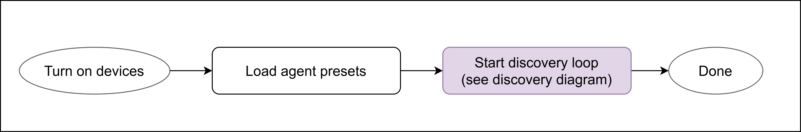
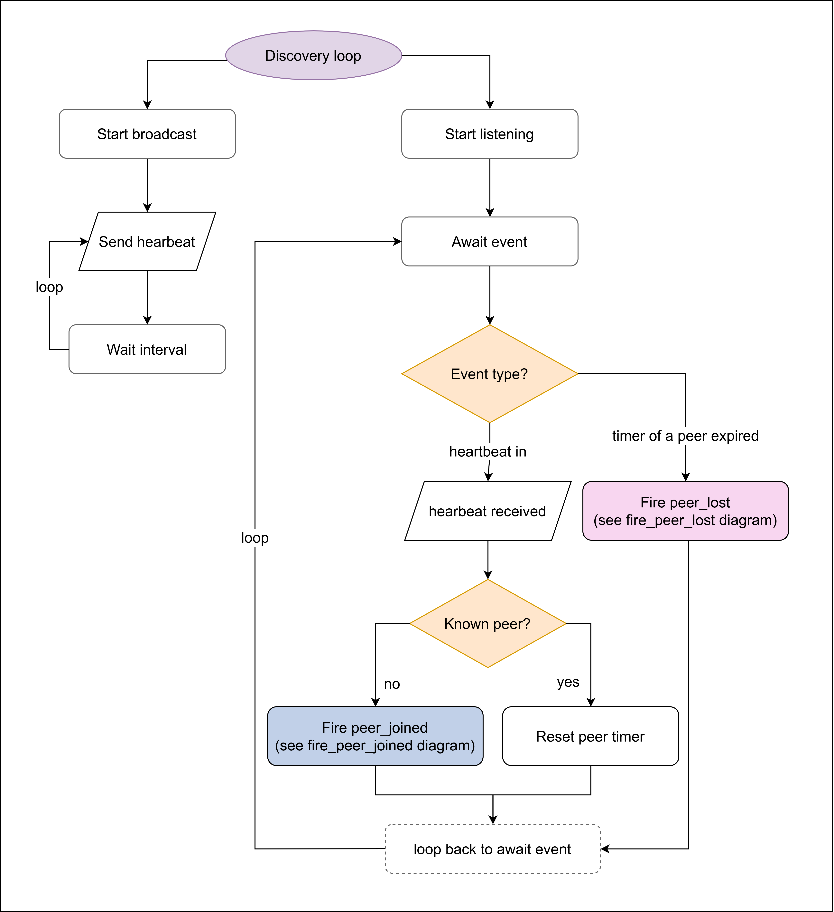
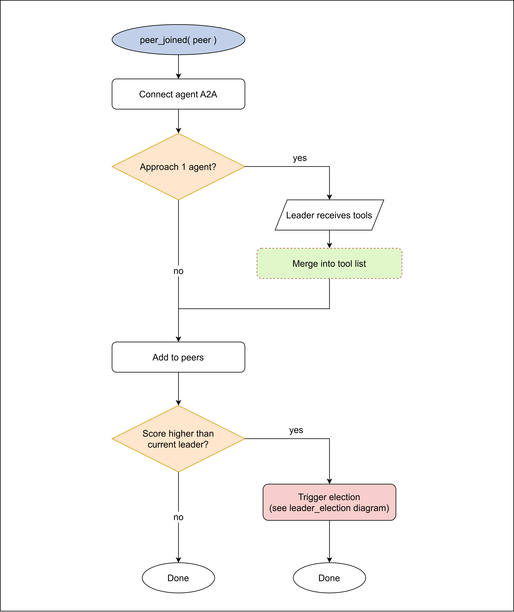
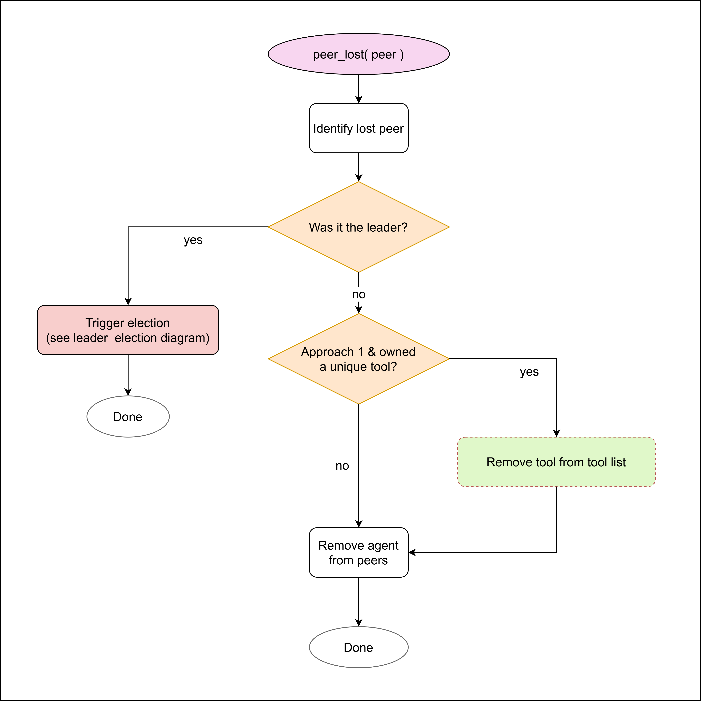
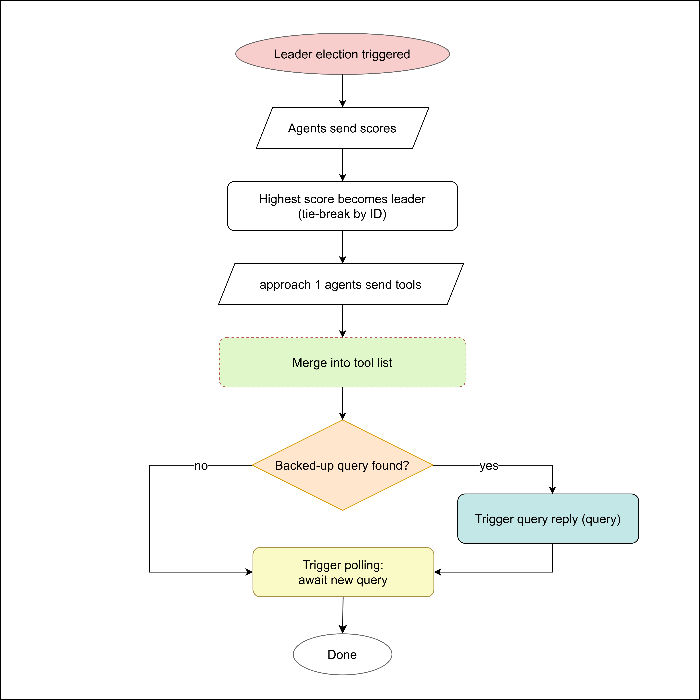
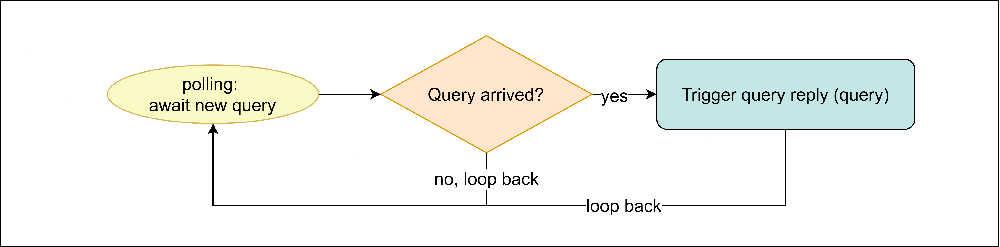
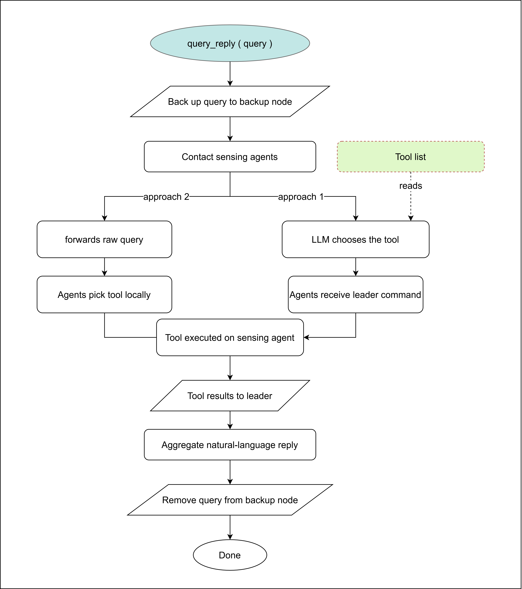

# Heterogeneous Edge AI Network

A distributed **agentic system** in which a fleet of heterogeneous embedded devices collaborate over a zero-configuration peer-to-peer (P2P) network, with **no cloud dependency**. The system answers natural-language queries by running a generative LLM on edge to dispatch hardware-accelerated skills — object detection, person detection, face recognition, camera capture — across the network and summarize the results back to the user.

---

## Agents

The unit of the network is the **agent**, identified by a unique agent-ID and bound to its **own dedicated TCP port**. A TCP connection is therefore established per *agent*, not per device. There are two kinds:

- **Sensing agent** — executes skills (tools) on local hardware (NPU / accelerator / CPU) and returns the results.
- **Leader agent** — manages user interaction over Telegram, runs an on-device LLM, and formats the collected replies into a natural-language answer. There is exactly **one** leader agent in the network at any time.

Sensing agents and leader agents can **co-live on the same physical device** — each keeps its own agent-ID and its own port, so they act as two independent agents (two separate TCP endpoints) that happen to share an IP.

Leadership is decided by **on-device election**. The election score is computed **per device** from its hardware (accelerator, RAM, CPU, memory bandwidth); the highest-scoring device runs the leader agent. If that agent goes down, the next-best device is promoted automatically — conversation history included (continuously backed up on the second-strongest device).

2 approaches shown in the following pictures are proposed they differ with respect to how tool calling is performed.
Given a user query through telegram:
1) approach 1 uses an LLM on the leader agent to perform distributed tool calling, then gathers the results and gives the user a natural language reply


2) approach 2 uses a classifier or cross encoder to perform the tool call directly on the sensing agent, the LLM on the leader agent gathers the results and gives the user a natural language reply as in approach 1.


NOTE: Only approach 1 is fully implemented!
---

## How it works: runtime flow

The seven flowcharts below trace a device from power-on, through peer discovery, leader election and failover, to answering a user query.

Shape legend:

| Symbol | Meaning |
|---|---|
| Ellipse / oval | Terminator (entry point or "Done") |
| Rounded rectangle | Process / action step |
| Diamond | Decision / branch |
| Parallelogram | Input/Output: data sent to or received from another node |
| Coloured box with "(see X diagram)" text | Call into another flowchart (a subroutine) |
| Green box, red dashed border | The shared tool-list data store, and reads/writes on it |

**1. Device startup** - load agent presets, then enter the discovery loop.



**2. Peer discovery** - the continuous announce/listen loop that finds other agents.



**3. Peer joined** - what happens when a new peer is discovered.



**4. Peer lost** - handling a peer that stopped announcing.



**5. Leader election** - score-based selection of the single leader.



**6. Query polling** - the leader's loop that receives user queries.



**7. Query reply** - dispatch to sensing agents, aggregate, and answer the user.



---

## What's in here

The repository has two top-level parts: the working **implementation** of the network, and the **benchmark code** used to characterize the models and the edge hardware.

| Folder | Contents |
|---|---|
| [`IMPLEMENTATION/`](IMPLEMENTATION/README.md) | The full agentic P2P system: discovery, leader election, leader/sensing logic, LLM dispatch pipeline |
| [`BENCHMARK CODE/`](BENCHMARK%20CODE/README.md) | Accuracy, latency, and power-consumption benchmarks for the models and edge boards |

### Hardware targets

| Device | Role | Accelerator | Model |
|---|---|---|---|
| Raspberry Pi 5 + Hailo AI HAT+ 2 | Leader / Sensing | Hailo H10 (40 TOPS) | `qwen3:1.7b` |
| STM32MP257F-DK | Leader / Sensing | On-chip NPU | `functiongemma:270m` |
| Generic Linux device (e.g. Intel NUC) | Leader / Sensing | CPU (llama.cpp) | score-selected GGUF |

---

## Documentation map

All documentation lives next to the code it describes. Start with the implementation README, then drill into the area you need.

### Implementation

- **[IMPLEMENTATION/README.md](IMPLEMENTATION/README.md)** — system overview: the two-step LLM pipeline, command/skill model, leader inference modes, election and device presets, configuration, and per-board setup (Raspberry Pi 5, STM32MP257FDK).
- **[IMPLEMENTATION/ConnectionLogic/README.md](IMPLEMENTATION/ConnectionLogic/README.md)** — the P2P networking layer: UDP discovery, TCP transport, mesh/IP-assignment options, and a thorough cross-platform connection-troubleshooting guide (Linux & Windows firewalls).

### Benchmarks

> **Where each benchmark runs.** The **accuracy** and **FunctionGemma-handler** benchmarks are meant to run on an external workstation (a CUDA GPU PC) — *not* on the edge boards. They use the same model files deployed on edge but need a GPU for fast throughput. Only the **power-consumption** benchmark runs on the edge devices themselves.

- **[BENCHMARK CODE/README.md](BENCHMARK%20CODE/README.md)** — index of the three benchmark suites.
- **[BENCHMARK CODE/ACCURACY/README.md](BENCHMARK%20CODE/ACCURACY/README.md)** — LLM tool-call accuracy (Parts A, B, C): single-tool dispatch, LLM-vs-reranker comparison, and reply summarization. **Runs on an external GPU workstation**, not on the edge devices.
- **[BENCHMARK CODE/FUNCTIONGEMMA TEST HANDLERS/README.md](BENCHMARK%20CODE/FUNCTIONGEMMA%20TEST%20HANDLERS/README.md)** — accuracy/latency comparison of the grammar-enforcing FunctionGemma handlers. Also runs on the **external GPU workstation**.
- **[BENCHMARK CODE/POWERCONSUMPTION/README.md](BENCHMARK%20CODE/POWERCONSUMPTION/README.md)** — runs **directly on the two edge boards** (Raspberry Pi 5 + Hailo, STM32MP257F-DK). It measures power draw and inference throughput (FPS, tokens/s) across configurations that run the LLM and detection workloads on the **CPU vs. the on-board NPU / AI accelerator** (Hailo on the Pi, on-chip NPU on the STM32) — each workload solo and the two in parallel — to find the most efficient way to split inference.

---

## Quick start

[`IMPLEMENTATION/`](IMPLEMENTATION/README.md) is the folder you **copy onto every device** in the network. Every node runs the *same* code — what an agent does is decided by its `device_profile.json` and presets, not by a different program. On each device, install the requirements and run `main.py`; it reads the device profile, scores the hardware, discovers peers, and joins leader election automatically.

```bash
# on each device, inside the copied IMPLEMENTATION/ folder
pip install -r requirements/base.txt   # plus generic.txt or hailo.txt per device
python main.py
```

To simulate a second device on the same machine (for testing), run another copy on a different port:

```bash
python main.py --port 5002
```

Per-device setup (Hailo packages, Ollama models, OpenSTLinux AI packages, Telegram token, etc.) is documented in **[IMPLEMENTATION/README.md](IMPLEMENTATION/README.md)**.

> **Note:** the mesh-networking and CLASSIFIER + LLM architecture sections in the sub-READMEs are described as theoretical / not yet implemented — see those documents for the current status.
